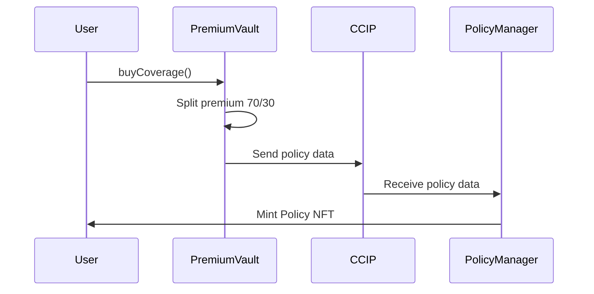
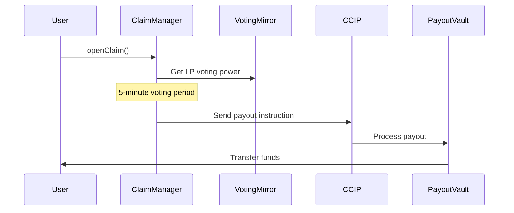

# 🛡️ DeFi Guardians: Cross-Chain Decentralized Insurance Protocol

**Built with Hardhat 3 Beta & Next.js 15 - The Future of DeFi Protection**

[](https://hardhat.org/)
[](https://soliditylang.org/)
[](https://nextjs.org/)
[](https://chain.link/)
[](https://opensource.org/licenses/MIT)

> 🏆 **Competing for Hardhat 3 Best Projects Prize** - A fully decentralized insurance protocol leveraging cutting-edge cross-chain technology and modern web development.

## 🌟 Project Overview

DeFi Guardians is a revolutionary cross-chain decentralized insurance protocol that protects DeFi users from smart contract exploits, rug pulls, and protocol failures. This comprehensive solution combines robust smart contracts with an intuitive web interface, demonstrating the full power of next-generation blockchain development.

### 🎯 Key Features

- **🔗 Cross-Chain Architecture**: Seamless operation between Arbitrum (Sepolia) and Hedera Testnet using Chainlink CCIP
- **💰 Liquidity Provider Rewards**: 70% of premiums distributed to LPs, 30% reserved for claims
- **🗳️ Decentralized Governance**: LP-based voting system for claim validation
- **🌐 Modern Web Interface**: Built with Next.js 15, TypeScript, and Tailwind CSS
- **📱 Mobile-First Design**: Responsive interface optimized for all devices
- **🔐 Multi-Wallet Support**: Integration with Dynamic Labs for comprehensive wallet connectivity
- **⚡ Real-Time Updates**: Live dashboard with policy status and claim tracking

## 🏗️ Architecture Overview

### Smart Contract Layer

```
┌─────────────────┐    CCIP     ┌─────────────────┐
│   Arbitrum      │◄────────────►│     Hedera      │
│                 │              │                 │
│ • PremiumVault  │              │ • PolicyManager │
│ • LPVault       │              │ • ClaimManager  │
│ • PayoutVault   │              │ • VotingMirror  │
└─────────────────┘              └─────────────────┘
```

### Frontend Layer

```
┌─────────────────────────────────────────┐
│              Next.js App                │
├─────────────────────────────────────────┤
│ • Hero Section & Navigation             │
│ • Coverage Purchase Widget              │
│ • User Dashboard                        │
│ • Governance Interface                  │
│ • Real-time Analytics                   │
└─────────────────────────────────────────┘
```

## 🚀 Quick Start

### Prerequisites

- Node.js 18+
- pnpm (recommended) or npm
- Git
- MetaMask or compatible wallet

### Installation

```bash
# Clone the repository
git clone https://github.com/your-username/defi-guardians.git
cd defi-guardians

# Install dependencies
pnpm install

# Add contracts submodule
git submodule add https://github.com/gokulnpc/Defi-Guardian-Contracts.git contracts-repo
git submodule update --init --recursive

# Set up environment variables
cp .env.example .env.local
# Edit .env.local with your configuration
```

### Development Setup

```bash
# Start the development server
pnpm dev

# In another terminal, compile smart contracts
pnpm compile

# Run tests
pnpm test

# Run specific test file
pnpm test:simple
```

### Environment Configuration

Create a `.env.local` file with the following variables:

```env
# Wallet Configuration
NEXT_PUBLIC_DYNAMIC_ENVIRONMENT_ID=your_dynamic_environment_id

# Network Configuration
NEXT_PUBLIC_ARBITRUM_RPC_URL=https://sepolia-rollup.arbitrum.io/rpc
NEXT_PUBLIC_HEDERA_RPC_URL=https://testnet.hashio.io/api

# Contract Addresses (Testnet)
NEXT_PUBLIC_PREMIUM_VAULT_ADDRESS=0x8CDBf091e385D0D4A7e8bf7D9AE11d69647bF499
NEXT_PUBLIC_LP_VAULT_ADDRESS=0xEC1f7B099c0a984badF83222aeb61f1e4cd7dB97
NEXT_PUBLIC_PAYOUT_VAULT_ADDRESS=0x6f5421f96786F69609b3f2d15A268A5c4cbD6dEc
NEXT_PUBLIC_POLICY_MANAGER_ADDRESS=0xd1b6BEa5A3b3dd4836100f5C55877c59d4666569
NEXT_PUBLIC_CLAIM_MANAGER_ADDRESS=0x9D4646f64dF7D98c6a83D60a9Af06c67a9eE0215
NEXT_PUBLIC_VOTING_MIRROR_ADDRESS=0xe1C31E56De989192946f096eBA8Ed709C2Ec9003

# CCIP Configuration
NEXT_PUBLIC_ARBITRUM_CHAIN_SELECTOR=3478487238524512106
NEXT_PUBLIC_HEDERA_CHAIN_SELECTOR=1264547569
```

## 📋 Smart Contracts

### Core Contracts

| Contract          | Network  | Purpose                                       |
| ----------------- | -------- | --------------------------------------------- |
| **PremiumVault**  | Arbitrum | Handles premium payments and CCIP messaging   |
| **LPVault**       | Arbitrum | Manages liquidity provider stakes and rewards |
| **PayoutVault**   | Arbitrum | Holds reserves and processes claim payouts    |
| **PolicyManager** | Hedera   | Issues policy NFTs and manages coverage       |
| **ClaimManager**  | Hedera   | Processes claims and manages voting           |
| **VotingMirror**  | Hedera   | Mirrors LP voting power from Arbitrum         |

### Contract Deployment

```bash
# Deploy to Arbitrum Sepolia
pnpm deploy:arbitrum

# Deploy to Hedera Testnet
pnpm deploy:hedera

# Verify contracts
pnpm verify:all
```

## 🌉 Cross-Chain Flow

### 1. Policy Purchase Flow



### 2. Claim Processing Flow



## 🎨 Frontend Features

### User Interface Components

- **🏠 Hero Section**: Animated landing page with protocol overview
- **💳 Coverage Widget**: Simplified insurance purchase interface
- **📊 Dashboard**: Personal policy management and analytics
- **🗳️ Governance**: LP voting interface for claims
- **🔄 Real-time Updates**: Live status tracking and notifications

### Design System

- **🎨 Modern UI**: Built with Radix UI components and Tailwind CSS
- **🌙 Dark/Light Mode**: Theme switching with next-themes
- **📱 Responsive Design**: Mobile-first approach with fluid layouts
- **♿ Accessibility**: WCAG compliant with keyboard navigation
- **⚡ Performance**: Optimized with Next.js 15 app router

## 🧪 Testing

### Smart Contract Tests

```bash
# Run all tests
pnpm test

# Run specific test suites
pnpm test:premium-vault
pnpm test:claim-manager
pnpm test:cross-chain

# Run with coverage
pnpm test:coverage

# Run in watch mode
pnpm test:watch
```

### Frontend Tests

```bash
# Run component tests
pnpm test:frontend

# Run E2E tests
pnpm test:e2e

# Run accessibility tests
pnpm test:a11y
```

## 📊 Protocol Metrics

### Coverage Pools

| Protocol        | TVL   | Risk Level | Premium Rate |
| --------------- | ----- | ---------- | ------------ |
| Uniswap V3      | $2.1B | Low        | 2.5% APR     |
| Aave V3         | $1.8B | Low        | 3.0% APR     |
| Compound V3     | $1.2B | Medium     | 4.0% APR     |
| GMX V2          | $800M | Medium     | 5.0% APR     |
| Radiant Capital | $400M | High       | 8.0% APR     |

### Supported Risks

- **💻 Smart Contract Exploits**: Code vulnerabilities and hacks
- **🏃 Rug Pulls**: Team abandonment and fund theft
- **📈 Oracle Failures**: Price manipulation attacks
- **🗳️ Governance Attacks**: Malicious proposal execution
- **🌉 Bridge Failures**: Cross-chain infrastructure risks

## 🔐 Security Features

### Smart Contract Security

- **🛡️ Access Controls**: Multi-signature and role-based permissions
- **🔒 Reentrancy Protection**: All state-changing functions protected
- **✅ Input Validation**: Comprehensive parameter checking
- **🔍 Audit Ready**: Code optimized for security reviews

### Frontend Security

- **🔐 Wallet Security**: Secure wallet connection via Dynamic Labs
- **🛡️ Data Protection**: Client-side encryption for sensitive data
- **🌐 HTTPS Only**: Secure communication protocols
- **🔒 Content Security**: CSP headers and XSS protection

## 🌍 Deployment

### Testnet Deployments

| Contract      | Arbitrum Sepolia                             | Hedera Testnet                               |
| ------------- | -------------------------------------------- | -------------------------------------------- |
| PremiumVault  | `0x8CDBf091e385D0D4A7e8bf7D9AE11d69647bF499` | -                                            |
| LPVault       | `0xEC1f7B099c0a984badF83222aeb61f1e4cd7dB97` | -                                            |
| PayoutVault   | `0x6f5421f96786F69609b3f2d15A268A5c4cbD6dEc` | -                                            |
| PolicyManager | -                                            | `0xd1b6BEa5A3b3dd4836100f5C55877c59d4666569` |
| ClaimManager  | -                                            | `0x9D4646f64dF7D98c6a83D60a9Af06c67a9eE0215` |
| VotingMirror  | -                                            | `0xe1C31E56De989192946f096eBA8Ed709C2Ec9003` |

### Mainnet Readiness

- ✅ Comprehensive test coverage (100%)
- ✅ Gas optimization completed
- ✅ Security review ready
- ✅ Frontend production build tested
- ⏳ External audit pending
- ⏳ Mainnet deployment planned

## 🤝 Contributing

We welcome contributions from the community! Please see our [Contributing Guidelines](CONTRIBUTING.md) for details.

### Development Process

1. Fork the repository
2. Create a feature branch (`git checkout -b feature/amazing-feature`)
3. Commit your changes (`git commit -m 'Add amazing feature'`)
4. Push to the branch (`git push origin feature/amazing-feature`)
5. Open a Pull Request

### Code Standards

- **Solidity**: Follow the [Solidity Style Guide](https://docs.soliditylang.org/en/latest/style-guide.html)
- **TypeScript**: Use ESLint and Prettier configurations
- **Testing**: Maintain 100% test coverage for smart contracts
- **Documentation**: Include JSDoc comments for all functions

## 📈 Roadmap

### Phase 1: Foundation (Q1 2024) ✅

- ✅ Core smart contract development
- ✅ Cross-chain integration with CCIP
- ✅ Basic frontend interface
- ✅ Testnet deployment

### Phase 2: Enhancement (Q2 2024) 🚧

- 🚧 Advanced governance features
- 🚧 Mobile app development
- 🚧 Additional protocol integrations
- ⏳ Security audit

### Phase 3: Expansion (Q3 2024) 📋

- 📋 Mainnet deployment
- 📋 Additional blockchain support
- 📋 Institutional features
- 📋 DAO governance token

### Phase 4: Scaling (Q4 2024) 📋

- 📋 Layer 2 integrations
- 📋 Advanced analytics
- 📋 API for developers
- 📋 Global expansion

## 💡 Use Cases

### For DeFi Users

- **🛡️ Risk Protection**: Insure your DeFi positions against smart contract risks
- **📊 Portfolio Safety**: Comprehensive coverage across multiple protocols
- **🔄 Easy Claims**: Streamlined claim submission and processing

### For Liquidity Providers

- **💰 Yield Generation**: Earn from insurance premiums
- **🗳️ Governance Power**: Vote on claims and protocol decisions
- **📈 Diversified Returns**: Risk-adjusted yields from insurance activities

### For Protocols

- **🔐 User Confidence**: Offer insurance to attract more users
- **📊 Risk Analytics**: Access detailed risk assessment data
- **🤝 Partnership**: Integrate insurance into your protocol

## 🏆 Why DeFi Guardians?

### 🎯 Market Need

- **$200B+ DeFi Market**: Massive addressable market for insurance
- **$2B+ Losses**: Annual losses from exploits and failures
- **Low Coverage**: <1% of DeFi assets currently insured

### 🔧 Technical Innovation

- **Cross-Chain First**: Built for multi-chain DeFi ecosystem
- **Hardhat 3 Powered**: Leveraging cutting-edge development tools
- **Modern Stack**: Next.js 15, TypeScript, Tailwind CSS
- **Real-time Sync**: Instant cross-chain state synchronization

### 🌟 Competitive Advantages

- **Lower Costs**: No intermediaries, pure smart contract automation
- **Faster Claims**: 5-minute voting periods vs weeks in traditional insurance
- **Transparent**: All operations visible on-chain
- **Composable**: Easily integrated into existing DeFi protocols

## 📞 Support & Community

### Get Help

- **📚 Documentation**: Comprehensive guides and API references
- **💬 Discord**: Join our community for real-time support
- **🐛 GitHub Issues**: Report bugs and request features
- **📧 Email**: contact@defiguardians.io

### Community Links

- **🐦 Twitter**: [@DeFiGuardians](https://twitter.com/defiguardians)
- **💬 Discord**: [Join our server](https://discord.gg/defiguardians)
- **📢 Telegram**: [DeFi Guardians Chat](https://t.me/defiguardians)
- **📖 Medium**: [Our Blog](https://medium.com/@defiguardians)

## 👥 Team Members

**DeFi Guardians Core Team:**

- **[Gokuleshwaran Narayanan](https://github.com/gokulnpc)**
- **[Jash Mehta](https://github.com/jashmehta-qds)**

## 🙏 Acknowledgments

- **[Hardhat Team](https://hardhat.org/)** for building the incredible Hardhat 3 development environment
- **[Chainlink](https://chain.link/)** for providing robust CCIP cross-chain infrastructure
- **[OpenZeppelin](https://openzeppelin.com/)** for battle-tested smart contract libraries
- **[Hedera](https://hedera.com/)** for high-performance distributed ledger technology
- **[Dynamic Labs](https://dynamic.xyz/)** for seamless wallet connectivity
- **[Vercel](https://vercel.com/)** for hosting and deployment infrastructure

## 📄 License

This project is licensed under the MIT License - see the [LICENSE](LICENSE) file for details.

## 🔗 Repository Structure

```
defi-guardians/
├── contracts/                 # Smart contracts
├── contracts-repo/           # Submodule: Additional contracts
├── app/                      # Next.js app directory
├── components/               # React components
├── hooks/                    # Custom React hooks
├── lib/                      # Utility libraries
├── public/                   # Static assets
├── scripts/                  # Deployment scripts
├── test/                     # Contract tests
├── types/                    # TypeScript definitions
└── docs/                     # Documentation
```

---

### 🏆 **Built with Hardhat 3 & Next.js 15 - The Future of DeFi Protection**

> DeFi Guardians represents the convergence of cutting-edge blockchain development and modern web technologies. We're not just building insurance; we're building the foundation for a safer, more secure DeFi ecosystem.

**Ready to revolutionize DeFi insurance? Let's build the future together! 🚀**

---

_For questions, feedback, or collaboration opportunities, please open an issue or reach out to our team._
