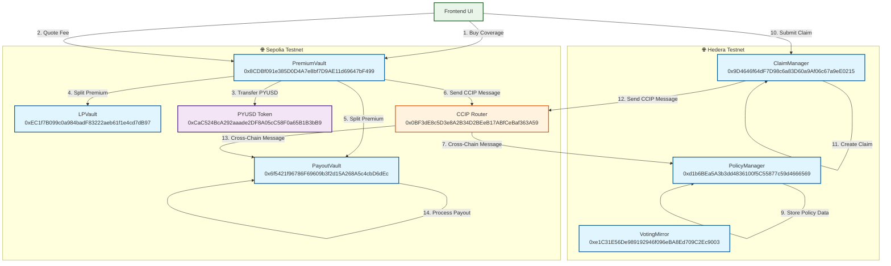
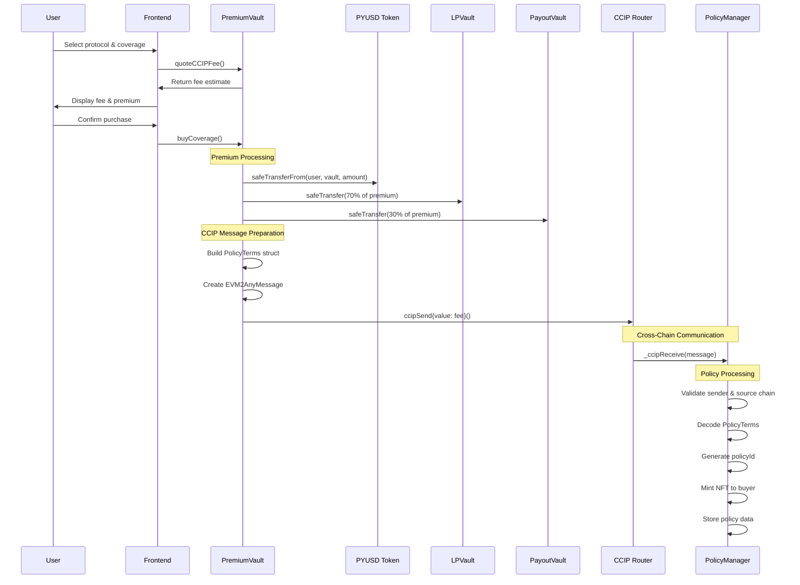
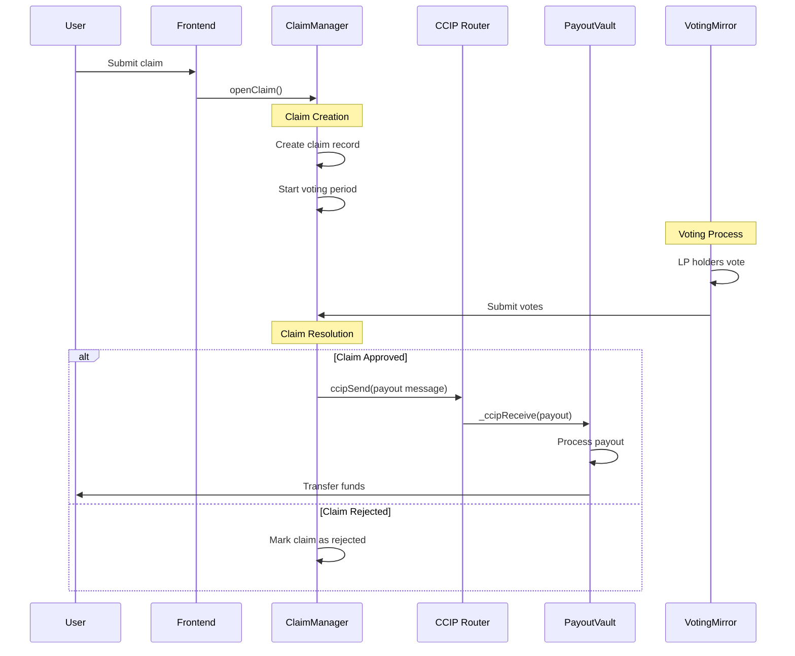

# DeFi Guardian - Cross-Chain Data Flow Diagram

## System Overview

The DeFi Guardian system enables cross-chain insurance coverage using Chainlink CCIP for secure message passing between Sepolia and Hedera testnet.

## Architecture Diagram



## Detailed Data Flow

### 1. Coverage Purchase Flow



### 2. Claims Processing Flow



## Contract Responsibilities

### Sepolia Contracts

| Contract | Address | Purpose |
|----------|---------|---------|
| **PremiumVault** | `0x8CDBf091e385D0D4A7e8bf7D9AE11d69647bF499` | Main entry point for coverage purchases |
| **LPVault** | `0xEC1f7B099c0a984badF83222aeb61f1e4cd7dB97` | Receives 70% of premiums for yield generation |
| **PayoutVault** | `0x6f5421f96786F69609b3f2d15A268A5c4cbD6dEc` | Receives 30% of premiums for reserves |
| **PYUSD** | `0xCaC524BcA292aaade2DF8A05cC58F0a65B1B3bB9` | Payment token for premiums |

### Hedera Contracts

| Contract | Address | Purpose |
|----------|---------|---------|
| **PolicyManager** | `0xd1b6BEa5A3b3dd4836100f5C55877c59d4666569` | Receives and processes policy registrations |
| **VotingMirror** | `0xe1C31E56De989192946f096eBA8Ed709C2Ec9003` | Handles governance voting for claims |
| **ClaimManager** | `0x9D4646f64dF7D98c6a83D60a9Af06c67a9eE0215` | Manages claim submission and processing |

## Security Checks

### PremiumVault (Sepolia)
- ✅ **Destination Chain Allowlist**: Only Hedera testnet allowed
- ✅ **Receiver Allowlist**: Only PolicyManager address allowed
- ✅ **Gas Limit Validation**: Prevents excessive gas usage

### PolicyManager (Hedera)
- ✅ **Source Chain Allowlist**: Only Sepolia allowed
- ✅ **Sender Allowlist**: Only PremiumVault address allowed
- ✅ **Message Deduplication**: Prevents replay attacks
- ✅ **Reentrancy Protection**: Uses ReentrancyGuard

## Data Structures

### PolicyTerms (Cross-Chain)
```solidity
struct PolicyTerms {
    bytes32 poolId;           // Protocol identifier
    address buyer;            // Coverage buyer
    uint256 coverageAmount;   // Coverage amount in PYUSD
    uint64  startTs;          // Coverage start timestamp
    uint64  endTs;            // Coverage end timestamp
    bytes32 policyRef;        // Policy reference hash
}
```

### Policy (Hedera)
```solidity
struct Policy {
    bytes32 poolId;
    address buyer;
    uint256 coverageAmount;
    uint64  startTs;
    uint64  endTs;
    bytes32 policyRef;
    uint256 tokenId;          // NFT token ID
    bool    active;           // Policy status
}
```

## Key Features

### 🔒 **Security**
- Cross-chain allowlisting
- Message deduplication
- Reentrancy protection
- Gas limit validation

### ⚡ **Efficiency**
- Deterministic policy IDs
- Minimal cross-chain data
- Optimized gas usage

### 🎯 **User Experience**
- Simple coverage purchase
- Transparent fee estimation
- NFT-based policy tracking
- Automated claims processing

## Network Configuration

| Network | Chain ID | Chain Selector | CCIP Router |
|---------|----------|----------------|-------------|
| **Sepolia** | 11155111 | `16015286601757825753` | `0x0BF3dE8c5D3e8A2B34D2BEeB17ABfCeBaf363A59` |
| **Hedera Testnet** | 296 | `222782988166878823` | Hedera CCIP Router |

## Current Status

- ✅ **PremiumVault**: Fixed and deployed with proper CCIP imports
- ✅ **Cross-Chain Communication**: Working via Chainlink CCIP
- ✅ **Fee Estimation**: Functional (`quoteCCIPFee` returns proper fees)
- ✅ **Frontend Integration**: Updated to use fixed contract
- ⚠️ **PolicyManager Configuration**: Requires manual verification on Hedera
