# DeFi Guardian - Complete Cross-Chain Data Flow

## System Overview

The DeFi Guardian system enables cross-chain insurance coverage using Chainlink CCIP for secure message passing between Sepolia and Hedera testnet. All security checks are now properly configured.

## Complete Architecture

```mermaid
graph TB
    %% User Interface
    UI[Frontend UI]
    
    %% Sepolia Network
    subgraph Sepolia ["🌐 Sepolia Testnet"]
        PV[PremiumVault<br/>0x8CDBf091e385D0D4A7e8bf7D9AE11d69647bF499<br/>✅ Fixed & Configured]
        LV[LPVault<br/>0xEC1f7B099c0a984badF83222aeb61f1e4cd7dB97]
        PAV[PayoutVault<br/>0x6f5421f96786F69609b3f2d15A268A5c4cbD6dEc]
        PYUSD[PYUSD Token<br/>0xCaC524BcA292aaade2DF8A05cC58F0a65B1B3bB9]
        CCIP_Router[CCIP Router<br/>0x0BF3dE8c5D3e8A2B34D2BEeB17ABfCeBaf363A59]
    end
    
    %% Hedera Network
    subgraph Hedera ["🌐 Hedera Testnet"]
        PM[PolicyManager<br/>0xd1b6BEa5A3b3dd4836100f5C55877c59d4666569<br/>✅ Configured]
        VM[VotingMirror<br/>0xe1C31E56De989192946f096eBA8Ed709C2Ec9003]
        CM[ClaimManager<br/>0x9D4646f64dF7D98c6a83D60a9Af06c67a9eE0215]
    end
    
    %% User Interactions
    UI -->|1. Buy Coverage| PV
    UI -->|2. Quote Fee| PV
    
    %% PremiumVault Operations
    PV -->|3. Transfer PYUSD| PYUSD
    PV -->|4. Split Premium (70%)| LV
    PV -->|5. Split Premium (30%)| PAV
    PV -->|6. Send CCIP Message| CCIP_Router
    
    %% CCIP Cross-Chain Communication
    CCIP_Router -->|7. Cross-Chain Message| PM
    
    %% PolicyManager Processing
    PM -->|8. Mint Policy NFT| PM
    PM -->|9. Store Policy Data| PM
    
    %% Claims Flow
    UI -->|10. Submit Claim| CM
    CM -->|11. Create Claim| CM
    CM -->|12. Send CCIP Message| CCIP_Router
    CCIP_Router -->|13. Cross-Chain Message| PAV
    
    %% Payout Processing
    PAV -->|14. Process Payout| PAV
    
    %% Styling
    classDef contract fill:#e1f5fe,stroke:#01579b,stroke-width:2px
    classDef router fill:#fff3e0,stroke:#e65100,stroke-width:2px
    classDef token fill:#f3e5f5,stroke:#4a148c,stroke-width:2px
    classDef ui fill:#e8f5e8,stroke:#1b5e20,stroke-width:2px
    classDef configured fill:#c8e6c9,stroke:#2e7d32,stroke-width:3px
    
    class PV,PM configured
    class LV,PAV,VM,CM contract
    class CCIP_Router router
    class PYUSD token
    class UI ui
```

## Security Check Flow

```mermaid
sequenceDiagram
    participant U as User
    participant PV as PremiumVault<br/>(Sepolia)
    participant CR as CCIP Router
    participant PM as PolicyManager<br/>(Hedera)

    U->>PV: buyCoverage()
    
    Note over PV: PremiumVault Security Checks
    PV->>PV: Check destination chain allowlist<br/>✅ Hedera (222782988166878823)
    PV->>PV: Check receiver allowlist<br/>✅ PolicyManager address
    PV->>PV: Check gas limit<br/>✅ 200,000 gas
    
    PV->>CR: ccipSend{value: fee}()
    
    Note over CR: CCIP Router Processing
    CR->>CR: Validate extraArgs format<br/>✅ Proper version tag
    CR->>CR: Route message to Hedera
    
    Note over PM: PolicyManager Security Checks
    PM->>PM: Check source chain allowlist<br/>✅ Sepolia (16015286601757825753)
    PM->>PM: Check sender allowlist<br/>✅ PremiumVault address
    PM->>PM: Check message deduplication<br/>✅ New messageId
    
    PM->>PM: Process policy & mint NFT
    PM->>U: Policy NFT minted
```



## Complete Data Flow

### 1. Coverage Purchase (Full Flow)

```mermaid
sequenceDiagram
    participant U as User
    participant UI as Frontend
    participant PV as PremiumVault
    participant PYUSD as PYUSD Token
    participant LV as LPVault
    participant PAV as PayoutVault
    participant CR as CCIP Router
    participant PM as PolicyManager

    U->>UI: Select protocol & coverage
    UI->>PV: quoteCCIPFee()
    PV->>UI: Return fee estimate (0.000122 ETH)
    UI->>U: Display fee & premium
    U->>UI: Confirm purchase
    
    Note over UI,PV: Transaction Execution
    UI->>PV: buyCoverage() with msg.value
    
    Note over PV: Premium Processing
    PV->>PYUSD: safeTransferFrom(user, vault, premium)
    PV->>LV: safeTransfer(70% of premium)
    PV->>PAV: safeTransfer(30% of premium)
    
    Note over PV: CCIP Message Preparation
    PV->>PV: Build PolicyTerms struct
    PV->>PV: Create EVM2AnyMessage with proper extraArgs
    PV->>CR: ccipSend{value: fee}()
    
    Note over CR,PM: Cross-Chain Communication
    CR->>PM: _ccipReceive(message)
    
    Note over PM: Policy Processing
    PM->>PM: Validate sender & source chain ✅
    PM->>PM: Decode PolicyTerms
    PM->>PM: Generate deterministic policyId
    PM->>PM: Mint NFT to buyer
    PM->>PM: Store policy data
    PM->>U: Policy NFT minted
```



### 2. Claims Processing Flow


## Security Configuration Status

### ✅ PremiumVault (Sepolia) - Fully Configured
- **Destination Chain Allowlist**: ✅ Hedera testnet (`222782988166878823`)
- **Receiver Allowlist**: ✅ PolicyManager (`0xd1b6BEa5A3b3dd4836100f5C55877c59d4666569`)
- **Gas Limit**: ✅ 200,000 gas
- **CCIP Integration**: ✅ Proper Chainlink imports

### ✅ PolicyManager (Hedera) - Fully Configured
- **Source Chain Allowlist**: ✅ Sepolia (`16015286601757825753`)
- **Sender Allowlist**: ✅ PremiumVault (`0x8CDBf091e385D0D4A7e8bf7D9AE11d69647bF499`)
- **Message Deduplication**: ✅ Prevents replay attacks
- **Reentrancy Protection**: ✅ Uses ReentrancyGuard

## Contract Addresses & Configuration

### Sepolia Testnet
| Contract | Address | Status | Configuration |
|----------|---------|--------|---------------|
| **PremiumVault** | `0x8CDBf091e385D0D4A7e8bf7D9AE11d69647bF499` | ✅ **Fixed** | Hedera allowlisted, gas limit set |
| **LPVault** | `0xEC1f7B099c0a984badF83222aeb61f1e4cd7dB97` | ✅ Deployed | Receives 70% of premiums |
| **PayoutVault** | `0x6f5421f96786F69609b3f2d15A268A5c4cbD6dEc` | ✅ Deployed | Receives 30% of premiums |
| **PYUSD** | `0xCaC524BcA292aaade2DF8A05cC58F0a65B1B3bB9` | ✅ Token | Payment currency |

### Hedera Testnet
| Contract | Address | Status | Configuration |
|----------|---------|--------|---------------|
| **PolicyManager** | `0xd1b6BEa5A3b3dd4836100f5C55877c59d4666569` | ✅ **Configured** | Sepolia & PremiumVault allowlisted |
| **VotingMirror** | `0xe1C31E56De989192946f096eBA8Ed709C2Ec9003` | ✅ Deployed | Governance voting |
| **ClaimManager** | `0x9D4646f64dF7D98c6a83D60a9Af06c67a9eE0215` | ✅ Deployed | Claims processing |

## Data Structures

### PolicyTerms (Cross-Chain Message)
```solidity
struct PolicyTerms {
    bytes32 poolId;           // Protocol identifier (32 bytes)
    address buyer;            // Coverage buyer address
    uint256 coverageAmount;   // Coverage amount in PYUSD
    uint64  startTs;          // Coverage start timestamp
    uint64  endTs;            // Coverage end timestamp
    bytes32 policyRef;        // Policy reference hash
}
```

### Policy (Hedera Storage)
```solidity
struct Policy {
    bytes32 poolId;
    address buyer;
    uint256 coverageAmount;
    uint64  startTs;
    uint64  endTs;
    bytes32 policyRef;
    uint256 tokenId;          // NFT token ID
    bool    active;           // Policy status
}
```

## Key Features

### 🔒 **Security**
- **Cross-Chain Allowlisting**: Only authorized chains and contracts
- **Message Deduplication**: Prevents replay attacks
- **Reentrancy Protection**: Secure against reentrancy attacks
- **Gas Limit Validation**: Prevents excessive gas usage
- **Proper CCIP Integration**: Uses official Chainlink library

### ⚡ **Efficiency**
- **Deterministic Policy IDs**: Consistent policy identification
- **Minimal Cross-Chain Data**: Optimized message size
- **Batch Processing**: Efficient premium splitting
- **NFT-Based Tracking**: Simple policy management

### 🎯 **User Experience**
- **Simple Coverage Purchase**: One-click insurance
- **Transparent Fee Estimation**: Clear cost breakdown
- **Real-Time Status**: Immediate feedback
- **Automated Processing**: No manual intervention needed

## Network Configuration

| Network | Chain ID | Chain Selector | CCIP Router | Status |
|---------|----------|----------------|-------------|--------|
| **Sepolia** | 11155111 | `16015286601757825753` | `0x0BF3dE8c5D3e8A2B34D2BEeB17ABfCeBaf363A59` | ✅ Configured |
| **Hedera Testnet** | 296 | `222782988166878823` | Hedera CCIP Router | ✅ Configured |

## Current Status: ✅ FULLY OPERATIONAL

- ✅ **PremiumVault**: Fixed and deployed with proper CCIP imports
- ✅ **PolicyManager**: Configured to accept messages from PremiumVault
- ✅ **Cross-Chain Communication**: All security checks passing
- ✅ **Fee Estimation**: Working (`quoteCCIPFee` returns proper fees)
- ✅ **Frontend Integration**: Updated to use fixed contract
- ✅ **Security**: All defensive checks properly configured

## Next Steps

The system is now **fully operational** and ready for:
1. **Coverage Purchases**: Users can buy insurance through the frontend
2. **Cross-Chain Policy Registration**: Policies are automatically registered on Hedera
3. **Claims Processing**: Users can submit and vote on claims
4. **Payout Processing**: Approved claims are automatically processed

All security checks are properly configured and the `InvalidExtraArgsTag()` error has been completely resolved!
